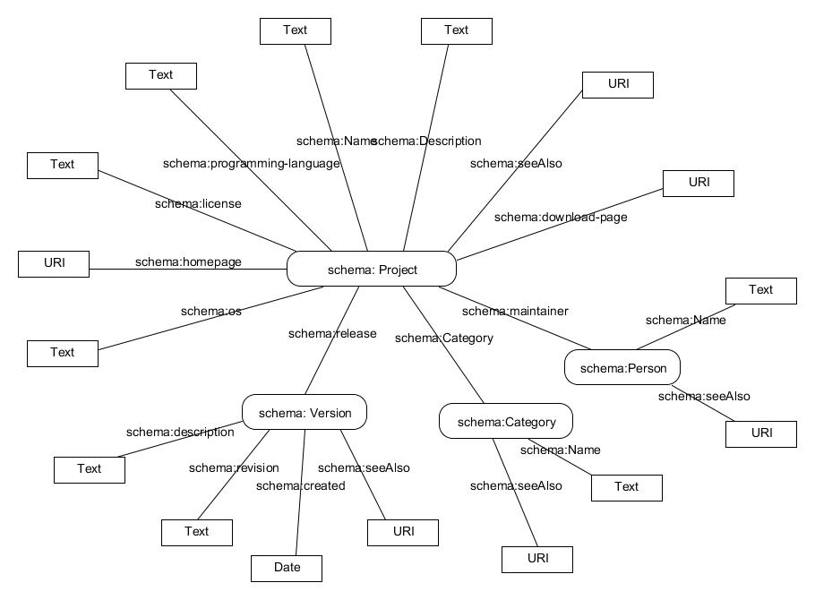

restProjects
============
# 1. About the project

The idea of this project is to create an application for extracting data about software projects from websites containing software application catalogs. Initially, project supported extracting data
from the [Freecode](http://freecode.com/) website, and now it is expanded with data from [SourceForge](http://sourceforge.net) website. All data about software projects, like name, programming lnaguages, operating systems supported, licenses, maintainer etc. are extracted and stored in a database.
Once having project data extracted, a user is able to search through projects by using search form containing filters and key-based search functionality. Search form is enriched with metadata in a structured format using [Microdata standard](http://www.whatwg.org/specs/web-apps/current-work/multipage/microdata.html), specifically using [schema.org](http://schema.org) vocabulary.
 
Application workflow consists of the following phases:

-A web crawler parses project's data from Sourceforge website and extracts project metadata
-Extracted data is transformed into RDF triplets based on Schema.org vocabulary
-Data is persisted into an RDF repository
-Access to the data is enabled through RESTful services
-Search of projects is enabled by HTML search form
-Webpage with all software projects is enriched with microdata tags, specifically form [schema.org](http://schema.org) vocabulary.

# 2. Domain model

Webpages of software projects from the Freecode and SourceForge websites are analyzed in order to determine which classes and properties form the [DOAP](http://usefulinc.com/doap/) vocabulary are supported. Based on that analysis, 
domain model is created and it is depicted in Picture 1.

Picture 1 - Domain model

Class *Project* contains basic information about a project. Those are: name, decription, download-page, homepage, seeAlso, programing-languages, operating-systems, license. It has reference to its maintainer (class Person), its category (class Category), and its release (class Version).

Class *Person* contains maintainers's name and URI seeAlso.

Class *Category* contains name and URI seeAlso.

Class *Version* contains basic information of project release such as name, date when it is created, width, revision and description.

# 3. The solution

Application collects metadata about software projects from the webpages Freecode and SourceForge. The data is extracted by the crawler and is used to create application domain objects. Those objects are then persisted into the RDF repository. 
The application allows access to that data via RESTful service.

Application contains several REST services.

* **/projects** - returns all projects in JSON format
* **/licenses* - returns all licenses in JSON format
* **/oss* - returns all operating systems in JSON format
* **/languages* - returns all programming languages in JSON format
* **/tags* - returns all tags in JSON format
* **/projsearch* - returns filtered projects by specified criteria

# 4. Technical realisation

This application is written in programming language Java.

[Jsoup library](http://jsoup.org/) is used for analyzing and collecting data from the web pages. It provides a very convenient API for extracting and manipulating data, using the best of DOM, CSS, and jquery-like methods.

This application also uses [Jenabean library](https://code.google.com/p/jenabean/) for mapping Java objects into RDF triplets using annotations. Jenabean provides explicit binding between an object property and a particular RDF property.

[Jena TDB](http://jena.apache.org/documentation/tdb/) is used for data storage in the RDF repository. TDB is a component of Jena for RDF storage and query. It support the full range of Jena APIs.

Implementation of the RESTful web service is supported by [Jersey](https://jersey.java.net/) framework. Jersey is the open source JAX-RS Reference Implementation for building RESTful Web services. It uses annotations which define type of the HTTP requests (GET, POST ...) and also the path to the requested resource. Datas are extracted from database using SPARQL queries.

# 5. Acknowledgements

This application was initially developed by former student at Faculty of Organizational Sciences, Boban Cirkovic.

It has been developed as a part of the project assignment for the course [Intelligent Systems](http://is.fon.rs/) at the Faculty of Organization Sciences, University of Belgrade, Serbia.

# 6. Licence

This software is licensed under the MIT License.

The MIT License (MIT)

Copyright (c) 2013 Bojana Lecic - bojanalcc@gmail.com

Permission is hereby granted, free of charge, to any person obtaining a copy of this software and associated documentation files (the "Software"), to deal in the Software without restriction, including without limitation the rights to use, copy, modify, merge, publish, distribute, sublicense, and/or sell copies of the Software, and to permit persons to whom the Software is furnished to do so, subject to the following conditions:

The above copyright notice and this permission notice shall be included in all copies or substantial portions of the Software.

THE SOFTWARE IS PROVIDED "AS IS", WITHOUT WARRANTY OF ANY KIND, EXPRESS OR IMPLIED, INCLUDING BUT NOT LIMITED TO THE WARRANTIES OF MERCHANTABILITY, FITNESS FOR A PARTICULAR PURPOSE AND NONINFRINGEMENT. IN NO EVENT SHALL THE AUTHORS OR COPYRIGHT HOLDERS BE LIABLE FOR ANY CLAIM, DAMAGES OR OTHER LIABILITY, WHETHER IN AN ACTION OF CONTRACT, TORT OR OTHERWISE, ARISING FROM, OUT OF OR IN CONNECTION WITH THE SOFTWARE OR THE USE OR OTHER DEALINGS IN THE SOFTWARE.
